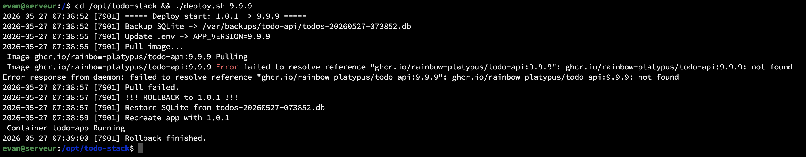
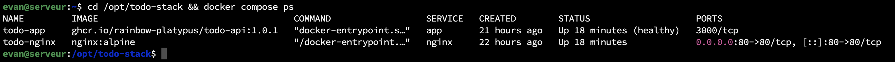
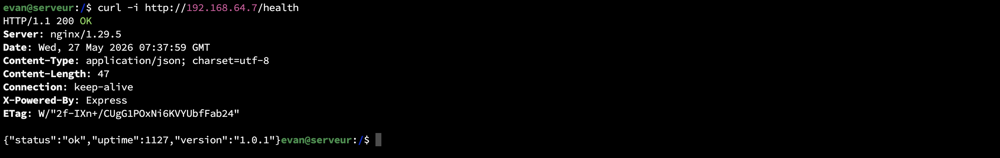
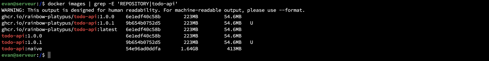

# TP2 — Journal

## Contexte
- VM : Ubuntu 24.04 LTS sur Mac M2 (192.168.64.7), utilisateur `evan`
- Application : `todo-api` (Node 20 + Express + SQLite + JWT) du TP1
- Image publiée : `ghcr.io/rainbow-platypus/todo-api:1.0.0` / `:1.0.1` / `:latest`
- Package GitHub : https://github.com/users/Rainbow-Platypus/packages/container/package/todo-api

## Étape 1 — Préparation environnement
Docker Engine + Compose v2 étaient déjà installés (Docker `29.4.2`, Compose `v5.1.3`),
utilisateur `evan` dans le groupe `docker`.

```bash
docker version
docker compose version
sudo systemctl disable --now todo-api nginx   # services TP1 désactivés
```

## Étape 2 — Dockerfile multi-stage
Voir `Dockerfile`. Points clés :
- **Stage builder** (`node:20-alpine`) : `apk add python3 make g++`, `npm ci`, copie code,
  `npm prune --omit=dev` pour ne garder que les deps de prod.
- **Stage runtime** (`node:20-alpine`) : `apk add wget` (pour le HEALTHCHECK uniquement),
  copie depuis le builder avec `--chown=node:node`, pré-création de `/var/lib/todo-api`
  appartenant à `node` (sinon le volume monté serait en root → SQLite refusé en écriture).
- `USER node`, `EXPOSE 3000`, `HEALTHCHECK` intégré sur `/health`, `CMD` en forme exec.

```bash
docker build -t todo-api:1.0.0 .
docker images todo-api
```

## Étape 3 — Push GHCR
PAT GitHub avec scope `write:packages`.

```bash
echo "$PAT" | docker login ghcr.io -u rainbow-platypus --password-stdin
docker tag todo-api:1.0.0 ghcr.io/rainbow-platypus/todo-api:1.0.0
docker tag todo-api:1.0.0 ghcr.io/rainbow-platypus/todo-api:latest
docker push ghcr.io/rainbow-platypus/todo-api:1.0.0
docker push ghcr.io/rainbow-platypus/todo-api:latest
```

> Le username GHCR doit être en minuscules (`rainbow-platypus`).

## Étape 4 — Stack Docker Compose (`/opt/todo-stack`)
Fichiers : `docker-compose.yml`, `nginx.conf`, `.env` (chmod 600, jamais commité).

```bash
sudo mkdir -p /opt/todo-stack && sudo chown evan:evan /opt/todo-stack
cd /opt/todo-stack
# … création des 3 fichiers …
chmod 600 .env
docker compose config --quiet   # validation
docker compose up -d
docker compose ps
curl http://localhost/health
```

Sortie attendue :
```
todo-app     ghcr.io/rainbow-platypus/todo-api:1.0.0   Up (healthy)   3000/tcp
todo-nginx   nginx:alpine                              Up             0.0.0.0:80->80/tcp
```

**Persistance** : création d'une todo, `docker compose down && up -d`, la todo est toujours là.

## Étape 5 — Script `deploy.sh`
Voir `deploy.sh`. Étapes : `set -euo pipefail`, log horodaté dans
`/var/log/todo-deploy.log`, backup SQLite via `docker run --rm` sur le volume,
update `.env`, `docker compose pull`, `docker compose up -d --no-deps app`,
smoke test `/health` avec retries, **rollback automatique** si échec (restaure version
précédente du `.env` + SQLite backup + recrée le service).

```bash
sudo mkdir -p /var/backups/todo-api && sudo chown evan:evan /var/backups/todo-api
sudo touch /var/log/todo-deploy.log && sudo chown evan:evan /var/log/todo-deploy.log
chmod +x /opt/todo-stack/deploy.sh

./deploy.sh 1.0.1        # déploie la nouvelle version
./deploy.sh 9.9.9        # image inexistante → rollback auto
```

### Test upgrade 1.0.0 → 1.0.1
```
2026-05-26 10:18:55  Deploy start: 1.0.0 -> 1.0.1
2026-05-26 10:18:55  Backup SQLite -> /var/backups/todo-api/todos-20260526-101855.db
2026-05-26 10:18:58  Update .env -> APP_VERSION=1.0.1
2026-05-26 10:19:02  Pull image OK
2026-05-26 10:19:02  Recreate app service (no-deps)
2026-05-26 10:19:18  Smoke test OK at try 2
2026-05-26 10:19:18  Deploy success: 1.0.0 -> 1.0.1
```
**Temps total : ~23 secondes** (vs ~30 minutes en TP1 manuel).

### Test rollback 1.0.0 → 9.9.9
```
Pull failed (image not found)
!!! ROLLBACK to 1.0.0 !!!
Restore SQLite from todos-20260526-101506.db
Recreate app with 1.0.0
Rollback finished.
```
`/health` répond toujours avec `"version":"1.0.0"`.



## Étape 6 — Validation

### a) Comparaison de tailles d'image
| Image                                         | Disk usage | Content size |
|-----------------------------------------------|------------|--------------|
| `todo-api:1.0.1` — multi-stage (`node:20-alpine`) | **223 MB** | **54.6 MB** |
| `todo-api:naive` — mono-stage (`node:20`, Debian + apt) | **1.64 GB** | **413 MB** |

Ratio : le naïf est **~7,4 ×** plus gros sur disque, **~7,5 ×** plus gros en contenu.
Causes : base Debian (vs Alpine), `build-essential` et `python3` embarqués dans le
runtime, `node_modules` non purgé des deps de dev.

Voir `Dockerfile.naive` pour le Dockerfile de comparaison.

### b) Test reboot
```bash
sudo reboot
# … VM offline ~30 s, SSH revient après ~85 s …
docker compose ps     # 2 containers Up tout seuls grâce à restart: unless-stopped
curl http://192.168.64.7/health
# {"status":"ok","uptime":13,"version":"1.0.1"}
```
La todo créée avant le reboot est toujours là → volume persistant OK.

### c) Test rollback (cf. Étape 5)
Voir extrait ci-dessus. `/health` reste sur l'ancienne version après rollback.

## Auto-évaluation
- [x] Image < 200 Mo (54.6 Mo de contenu)
- [x] Dockerfile à 2 stages (builder + runtime)
- [x] Compilation native de `better-sqlite3` dans le builder uniquement
- [x] Conteneur tourne sous `node` (UID 1000), pas root
- [x] HEALTHCHECK intégré (`wget /health`)
- [x] `.env` exclu de Git (`.gitignore`) et de Docker (`.dockerignore`)
- [x] `docker compose up -d` démarre la stack sans erreur
- [x] Données SQLite persistées via le volume nommé `todo-data`
- [x] Après `sudo reboot`, la stack remonte seule
- [x] `deploy.sh` rollback automatiquement si l'image est cassée



